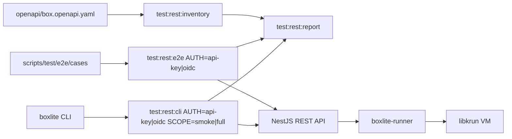
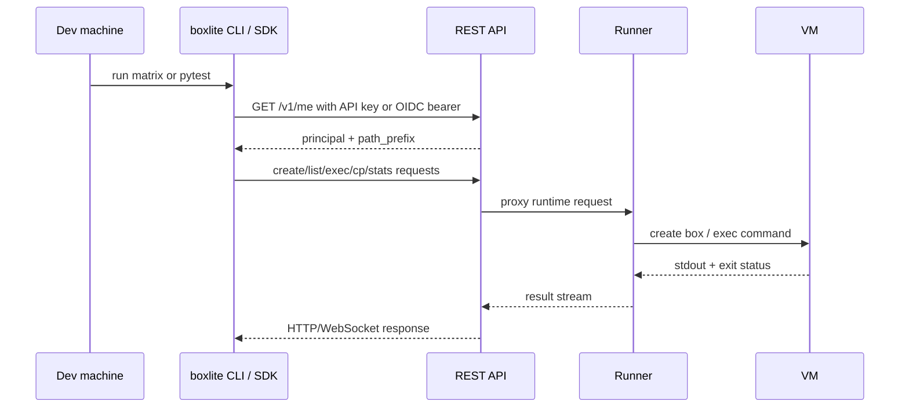

# REST API E2E Test Report and Runbook

This document defines the reusable BoxLite REST API test flow. It covers the
public REST contract, the existing SDK -> API -> Runner -> VM E2E suite, the
CLI command matrix, and both API-key and OIDC authentication modes.

## Test Stack



## Existing Base

The suite under `scripts/test/e2e` is already REST-backed. It builds a Python
SDK REST client and verifies that requests reach the API and Runner. It is not
a local FFI test path.

This PR fills the following gaps:

- static coverage inventory based on `openapi/box.openapi.yaml`;
- explicit `AUTH=api-key` and `AUTH=oidc` modes for REST E2E;
- a CLI command matrix for REST API behavior;
- explicit skips for commands or SDK entry points that are not REST-backed yet;
- shared output artifacts under `target/rest-test-report`.

## Where To Run

Run heavy verification on the dev machine or in CI. Do not run full REST E2E,
CLI integration, or `make test:apps` on the local Mac unless local rebuilds are
intentional.

Recommended narrow check, locally or on Remote:

```bash
cd apps && yarn nx test api --testNamePattern BoxliteWsProxyService --runInBand
```

Full validation belongs on the dev machine:

```bash
make test:rest:e2e AUTH=api-key
make test:rest:e2e AUTH=oidc
make test:rest:cli AUTH=api-key SCOPE=smoke
make test:rest:cli AUTH=oidc SCOPE=full
```

## Authentication Inputs

### API Key

REST E2E:

```bash
export BOXLITE_E2E_AUTH=api-key
export BOXLITE_E2E_API_KEY=<api-key>
export BOXLITE_E2E_API_URL=http://localhost:3000/api
make test:rest:e2e AUTH=api-key
```

CLI matrix:

```bash
export BOXLITE_REST_URL=https://<api-host>/api
export BOXLITE_API_KEY=<api-key>
make test:rest:cli AUTH=api-key SCOPE=smoke
```

### OIDC

REST E2E:

```bash
export BOXLITE_E2E_AUTH=oidc
export BOXLITE_E2E_OIDC_TOKEN=<access-token>
export BOXLITE_E2E_API_URL=http://localhost:3000/api
make test:rest:e2e AUTH=oidc
```

If `BOXLITE_E2E_OIDC_TOKEN` is not set, the E2E helper reads the local OIDC
profile and runs `boxlite auth whoami` first. That keeps token refresh behavior
aligned with real CLI commands.

The CLI matrix needs an existing OIDC login, or a profile that already contains
a valid OIDC session. Keep `BOXLITE_API_KEY` unset when running OIDC because it
takes precedence over profile credentials.

```bash
unset BOXLITE_API_KEY
boxlite --profile dev-oidc --url https://<api-host>/api auth login --method browser
BOXLITE_PROFILE=dev-oidc make test:rest:cli AUTH=oidc SCOPE=full
```

Both REST E2E auth modes discover `path_prefix` through `/v1/me` by default.
Only set `BOXLITE_E2E_PREFIX` when intentionally overriding server discovery.

## Request Flow



## Checklist

1. Static coverage inventory:

   ```bash
   make test:rest:inventory
   ```

2. Prepare the local E2E stack on the dev machine:

   ```bash
   make test:e2e:setup
   ```

3. Run API-key REST E2E:

   ```bash
   make test:rest:e2e AUTH=api-key
   ```

4. Prepare OIDC credentials:

   ```bash
   export BOXLITE_E2E_OIDC_TOKEN=<access-token>
   ```

5. Run OIDC REST E2E, or only the attach narrow check:

   ```bash
   make test:rest:e2e AUTH=oidc FILTER=attach
   ```

6. Run the CLI matrix on dev:

   ```bash
   make test:rest:cli AUTH=api-key SCOPE=smoke
   make test:rest:cli AUTH=oidc SCOPE=full
   ```

7. Generate the aggregate report:

   ```bash
   make test:rest:report
   ```

## Skip Rules

Skips must be explicit in artifacts. Current intentional skips:

- `boxlite info`: reports local runtime/options, not REST-backed behavior.
- `boxlite logs`: reads local runtime console logs, not REST-backed stdout.
- `boxlite pull` and `boxlite images`: REST runtime does not support image
  operations yet.
- `boxlite remove`: no such command exists; `boxlite rm` is the supported
  command.
- C/Go/Node E2E entry-point tests under `AUTH=oidc`: these SDK smoke drivers
  currently expose only API-key credential inputs.

## Artifacts

All reusable artifacts are written to:

```text
target/rest-test-report/
```

Key files:

- `rest-inventory.md` and `rest-inventory.json`;
- `cli-matrix-<auth>-<scope>.log`;
- `cli-matrix-<auth>-<scope>.skips`;
- `cli-matrix-<auth>-<scope>.md`;
- `rest-report.md`.

## Operating Principles

- Run smoke first, then the full matrix.
- Keep authentication modes isolated; do not set `BOXLITE_API_KEY` for OIDC CLI
  tests.
- Use isolated `BOXLITE_HOME` / `BOXLITE_PROFILE` values when testing
  credentials.
- Do not restart the dev API casually; restart only after narrow checks pass
  and API-side behavior needs verification.
- After API code changes, deploy or restart only the API surface under test,
  then rerun the `AUTH=oidc` attach/exec coverage.
